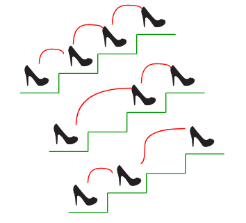

# Recursive-Staircase-Ruby


##### Given a staircase of _n_ steps, find the number of ways a person can reach the top if only 1-2 steps are allowed to be taken at a time.



```
Input: n = 0
Output: 1
There is only one way to climb 0 steps.

Input: n = 1
Output: 1
There is only one way to climb 1 step.

Input: n = 2
Output: 2
There are two ways: (1, 1) and (2)

Input: n = 4
Output: 5
There are five ways to climb 4 steps.
(1, 1, 1, 1), (1, 1, 2), (2, 1, 1), (1, 2, 1), (2, 2)
```
